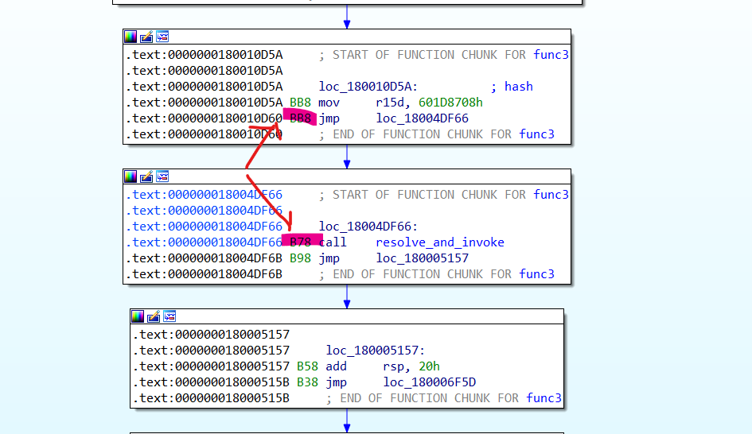
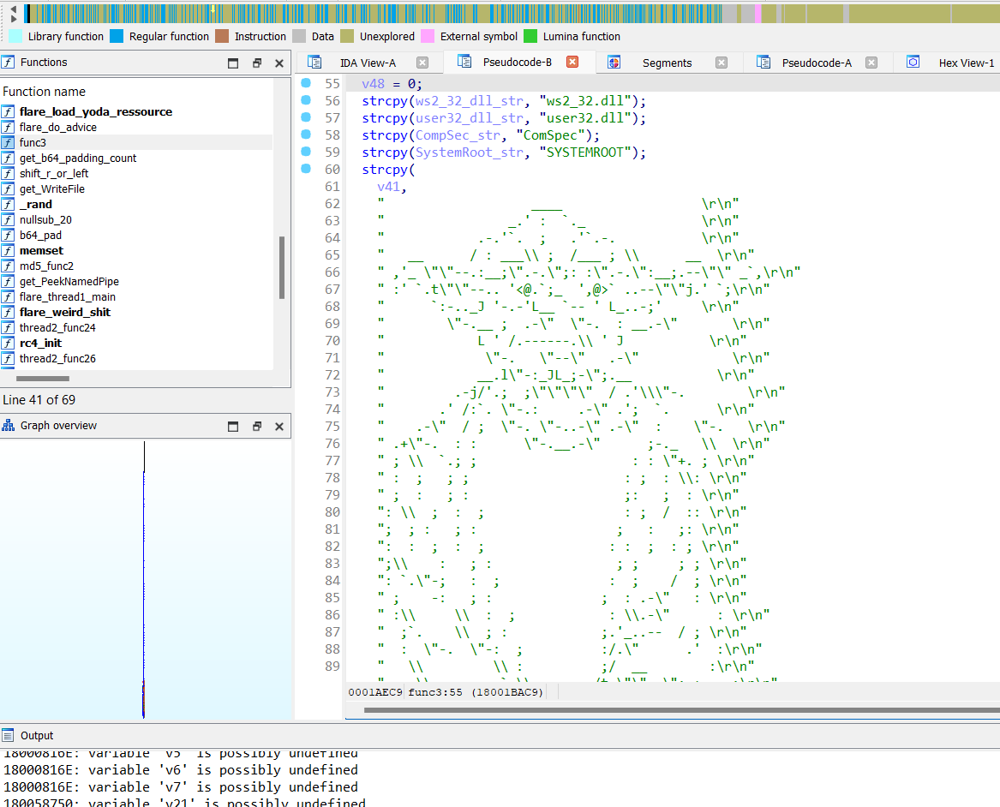

# Deobfuscating Y0da (Flare-on 10 last challenge)

## Introduction

Y0DA is a Windows binary "lightly" obfuscated. Each instruction is in its own basic block, jumping from one basic block to the next. The location of the various basic blocks are randomized (aka it jumps everywhere back and forth). 

## Challenges
IDA Pro gets really confused by this obfuscation technique. Overall two problems appear. One is that IDA will fail to recognize the correct function boundaries and wrongly define functions which will make analyzing them in hex-ray impossible (either the decompilation will fail or terminate prematuraly with a `jumpout(address)` statement ). 

The second problem is more pernicious; for some mysterious reasons, even if we are able to recover a function as a whole, the analysis still gets messed up as the algorithm to estimate the value of the stack pointer will end up all over the place; this is likely because the value of SP is propagated linearly while the many jumps make it that the instruction flow is far from linear (in many case, the "next" instruction may be before in memory, and potentially interspersed with other functions' basic blocks). The end result is IDA warning us that the "sp-analysis failed" and that the analysis could be wrong, which manifests in hex-ray by the wrong variables being referenced in the locations where the SP value is inaccurate. 


*Bad stack pointer (in red)*


## Solution

### The bad way

My first approach was to write and IDC script (no IDAPython :'( )) to fix the code. The process is as follow: 

0. Disable auto-analysis, "Trace stack pointer", "Perform full stack analysis" (Option->General Options-> Analysis) to prevent IDA algorithm from getting in the way
1. Fix a given function by following the `jmp`s (and recursively splitting on conditional jumps) to add basic blocks to the function being processed. The `del_func` and `append_func_tail` are used for this purpose. 
2. Run a multiple pass process to fix the stack value:
    1. Manually implement basic stack management using `add_user_stkpnt` to update stack pointer for `push`/`pop`/`sub rsp`/`add rsp` and a special use case for one of the function that leaves the stack unbalanced after being invoked. 
    2. Abuse the `add_user_stkpnt` to make it so that a given basic block has a "end" sp value of 0 to prevent propagating errors to other blocks (aka trying to mitigate the problem observed with ida). Supposedly the function should be called with the address of the first byte after the targeted instruction, but using an address halfway through the last instruction of a basic block works too. So for `jmp` which are 5 bytes long it's possible to call `add_user_stkpnt` at the 4th byte mark and it still works. This approach doesn't work for `ret` which are only one byte long (But when reaching ret, sp should already be 0 in most cases...). 
    3. Enforce the rule that jumping from one basic block to the next should have the same overall stack value as a `jmp` instruction doesn't affect the stack. 

Following these rules on a given function (`get_screen_ea` is useful here) and recursively calling the fix up function on the conditional branches fixes most of the problem related to the obfuscation and is enough to reverse the challenge's functions in hex-ray. One of the trick/bug is that doing this graph traversal may lead to an infinite recursion has sometimes there is a legitimate loop backward (e.g. in a "`jz _end;  jmp _loop`" pattern). The normal method to avoid processing the same basic block multiple time is to keep track of blocks previously visited; I couldn't find an effective way to do so in straight IDC so I marked blocks that are the target of a conditional jump as "visited for phase_X" using `set_cmt` and then retrieving comments using `get_cmt` and break if it matches the current phase of processing. 

To append a function tail we need to provide the end of the basic block, which needs to be discovered first. For that purpose, another gotcha to be aware of, the `next_head` function (used to get the next instruction address) may get confused if the target address wasn't defined as code, so to iterate over unknown instructions it's better to use the `auto insn = decode_insn(ea)` function call followed by `ea += insn.size` instead. 

The code to clean up the basic blocks and add them to the current function can be found [here](scripts/fix_basic_blocks.idc). Call `fixup()` on an instruction of the function; you may have to interrupt it (due to infinite recursion) and call it in a few locations of a given function where the graph traversal didn't reach.

 The code to fix up the stack can be found [here](scripts/fixt_stack.idc). Call `fix_stack()` at the first instruction of a function you want to cleanup. 


*Hard work resulting in a good import in hex ray*
### The better way

After having solved the challenge, someone was asking me for help and brought up an automated way to debofuscate the jmps. Thinking along those lines I remembered `keystone` & `capstome` which are lightweight assembler/disassembler with great python bindings. This led me to implement a second solution, this time using these tools. 

Instead of mis-using the `add_user_stkpnt` function in IDA, a much cleaner approach is to deobfuscate the actual code itself. Following the same graph traversing method described previously, the idea is to identify the original instructions (without all the extra jumps) and rebuild the assembly, one function at the time. Each function can be represented as a set of branches (a straight line that splits left/right on a conditional jump). Here we want to produce assembly for each branch then assemble the whole thing and write it "somewhere" in the binary. And while we are at it, we can be fancy and patch the existing call/function to jump to the deobfuscated function instead. 

The "somewhere" mentioned in the previous paragraph is an extra section we can add to the binary using [Lief]( https://lief-project.github.io/). That extra section will contain all the functions we plan on deobfuscating, laid out one after the next. 

Not having IDAPython, a good replacement is to leverage `Capstone` and `Keystone` to disassemble instruction and reassemble them. In this case to keep track of already visited basic blocks, a global list of addresses we've visited is enough. 

The process is as follows.
1. For a given function, follow the jumps to generate a so-called `branch` of instructions.
2. When finding a conditional jump, keep "left" and recursively call the branch processing function on the "right" side of the conditional jump. 
3. Append the disassembly of the current instruction to the branch being built.
4. Stop when reaching a `ret` or a basic block already visited and return all the `branches` generated during the process. 
5. It's also important to distinguish the `jmp` instructions coming from the obfuscation technique from a legitimate `jmp` that would normally appear in code. The heuristic for that is "if jumping to a basic block already visited, keep the `jmp` as it's likely a legitimate one".
6. Keep track of all the functions called and add them for processing (go back to 1. ).
7. Rely on user input to add functions not already discovered via this process (mainly function pointers used when the obfuscated binary creates new threads). 
8. For each deobfuscated function, replace the first instruction of its obfuscated self to a jump to the deobfuscated version (or alternatively, add an extra pass where all the calls to an obfuscated function is replaced with a call to the deobfuscated function, this could be done by keeping track of a dictionary obfuscated_addr -> deobfuscated_addr, replacings the addresses at callsites assuming the new call would takes the same amount of bytes as the original one in order to avoid miss-alignment issues). 

Two things important to note: 
- It's possible with keystone to create labels that will be the target of a jump (conditional or not). However sometimes the target of a jump will be an address already visited (when jumping backward in the execution flow). To avoid an extra pass to "insert" a label after the fact, it's actually possible to add labels at every instruction and let the assembler figure it out. An efficient label naming scheme is `loc_{ea}` where `ea` is the original address of the instruction. 
- If keystone is going to throw an error, it's possible to identify the line of code responsible for the error with the following code snippet:
```python
	try:		
		encoding, count = ks.asm(asm, target_address)
	except KsError  as e:
		print(e)
		print("Count: %i"%e.stat_count)
		count = e.stat_count
		print(asm.split("\n")[count-1])
```

Finally, it's pretty straightforward to add a section to the binary using lief: 

```python

# Note: the code commented out is left for documentation purposes:
# It was useful to figure out what were the exepcted value range
# using the .text section as a known quantity and help figure out
# what were the unnecessary parameters to create a new section. 
def patch_section(filename, data, target_address):
	import lief
	binary = lief.parse(filename)
	#text_section = binary.get_section(".text")
	#print(hex(text_section.virtual_address )) # va doesn't account for image base so the actual value is like 0x1000
	section = lief.PE.Section(".text.deobf")
	section.virtual_address = target_address - binary.imagebase 
	#section.size = len(data) + 0x1000
	#section.characteristics = text_section.characteristics
	section.content = data
	binary.add_section(section, lief.PE.SECTION_TYPES.TEXT)
	new_filename = filename+ "_patched.bin"
	binary.write(new_filename)
	return new_filename	
```


Here's an example of one of the deobfuscated functions (the block of blue on the right of the address bar is the section we've added, to be compared to the left side which is blue scattered all over the place due to the obfuscation)

